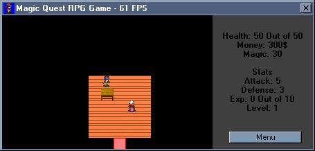



## Magicquest 2 \(simple rpg\)

### Description

ok the story is STILL not finished... but i think ive done just about it on the engine except for optimizing it... now you have different tiles with night and day (goes along with ur windows clock) and some other things.... please vote and comment!!! and leave all suggestions!
 
### More Info
 

             |
---                |---
**Submitted On**   |2002-04-29 16:04:26
**By**             |[poop\_4\_brains](https://github.com/Planet-Source-Code/PSCIndex/blob/master/ByAuthor/poop-4-brains.md)
**Level**          |Intermediate
**User Rating**    |4.4 (22 globes from 5 users)
**Compatibility**  |VB 6\.0
**Category**       |[Coding Standards](https://github.com/Planet-Source-Code/PSCIndex/blob/master/ByCategory/coding-standards__1-43.md)
**World**          |[Visual Basic](https://github.com/Planet-Source-Code/PSCIndex/blob/master/ByWorld/visual-basic.md)
**Archive File**   |[Magicquest773184292002\.zip](https://github.com/Planet-Source-Code/poop-4-brains-magicquest-2-simple-rpg__1-34229/archive/master.zip)

